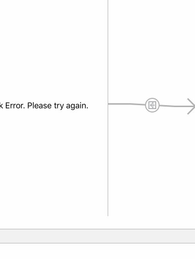

# RottenTomatoes Box Office Demo

This is an IOS demo application for displaying the latest box office movies using the [RottenTomatoes API](http://www.rottentomatoes.com/). 

Time spent: 15 hours spent in total

Completed user stories:

 * [x] Required: User can view a list of movies from Rotten Tomatoes. Poster images must be loading asynchronously.
 * [x] Required: User can view movie details by tapping on a cell.
 * [x] Required: User sees loading state while waiting for movies API. SVProgressHUD is used.
 * [x] Required: User sees error message when there's a networking error. You may not use UIAlertView or a 3rd party library to display the error. 
 * [x] Required: User can pull to refresh the movie list.
 * [x] Additional: Must use Cocoapods.
 * [x] Additional: Asynchronous image downloading must be implemented using the UIImageView category in the AFNetworking library.

Walkthrough of all user stories:

GIF created with [LiceCap](http://www.cockos.com/licecap/).
